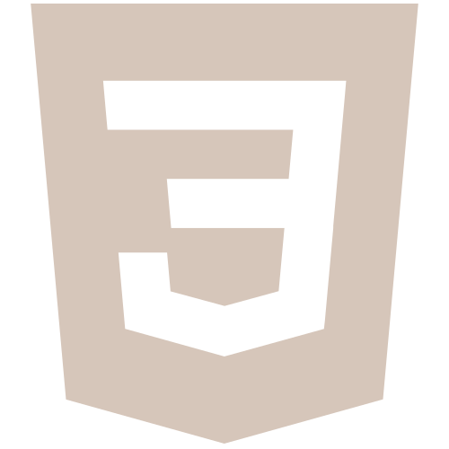
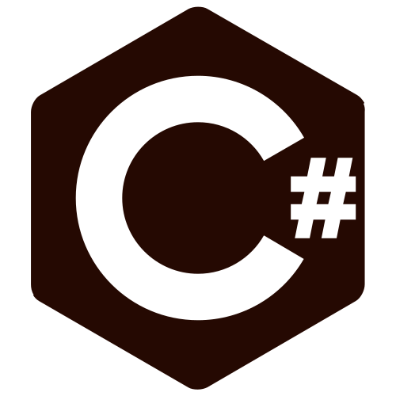
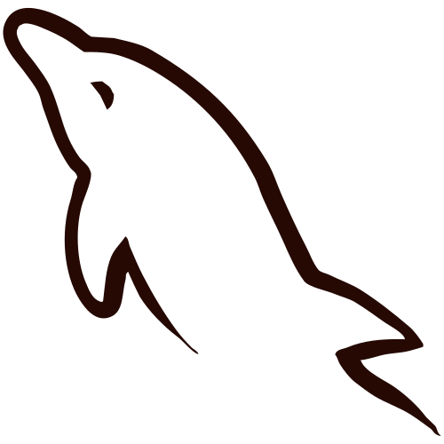
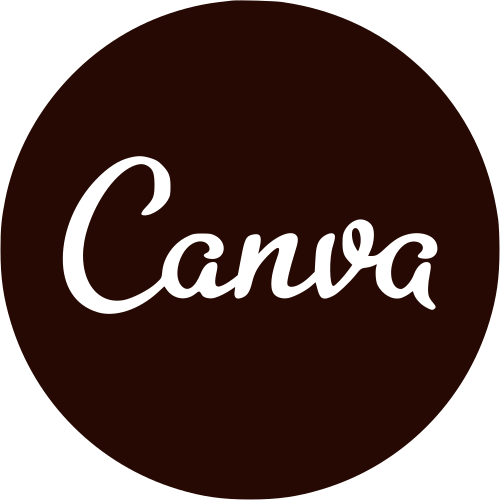

  
   ⊳ Mais conhecida como Elo;
   ⊳ Cursando Bacharelado em Sistemas de Informação no CEFET/NF;
   ⊳ Estudando para cada dia ser uma melhor versão;
   ⊳ Atualmente aprofundando os conhecimentos em CSharp e Python;
   ⊳ Amo a natureza e os bichinhos que vivem nela.

  
  
  
  
  
  
  
  
  

  
  
  

